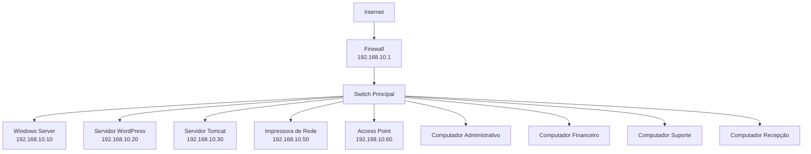
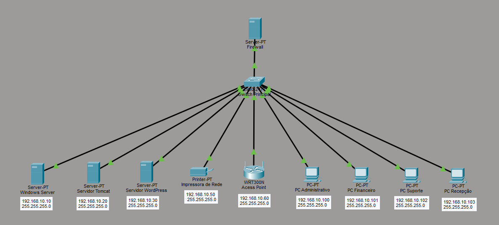

# Projeto Integrador - Rocket Solutions

Implantação da Infraestrutura de TI de uma Empresa Prestadora de Serviços.

---

## Descrição

A Rocket Solutions é uma empresa voltada para a área de tecnologia da informação, com foco na implementação de soluções corporativas, suporte aos usuários e gerenciamento de infraestrutura de redes e servidores.

---

## Identidade da Empresa

### Missão

Fornecer soluções tecnológicas eficientes, inovadoras e acessíveis, atendendo às necessidades dos clientes com agilidade, transparência e compromisso, contribuindo para o crescimento e a transformação digital de seus negócios.

### Visão

Ser reconhecida como uma referência em soluções de tecnologia, destacando-se pela excelência no atendimento, confiança dos clientes e capacidade de entregar resultados práticos e inovadores.

### Valores

* Transparência: atuar com ética, honestidade e clareza em todas as relações.
* Agilidade: oferecer soluções rápidas e eficientes para atender às demandas dos clientes.
* Inovação: buscar constantemente novas tecnologias e melhorias nos serviços prestados.
* Compromisso com o Cliente: compreender as necessidades de cada cliente e entregar soluções de valor.
* Qualidade: manter elevados padrões técnicos em todos os projetos e serviços.

---

## Objetivo Geral

Planejar, implantar, documentar e apresentar uma infraestrutura completa de TI para uma empresa fictícia de prestação de serviços, utilizando servidores Windows e Linux, rede corporativa, sistema de chamados e aplicação web.

---

## Topologia da Rede

Diagrama lógico da rede:

Imagem da topologia usada:

---

## Plano de Endereçamento IP

Rede: 192.168.10.0/24

| Categoria | Tipo | Faixa do Endereçamento |
|-|-|-|
| Segurança/Gateway | Estático | `192.168.10.1` |
| Servidores | Estático | `192.168.10.10 - 49` |
| Equipamentos de Rede | Estático | `192.168.10.50 - 69` |
| Computadores | DHCP | `192.168.10.100 - 199` |

### Segurança/Gateway

- Firewall → `192.168.10.1`

### Servidores

- Windows Server → `192.168.10.10`
- WordPress → `192.168.10.20`
- Tomcat → `192.168.10.30`

### Equipamentos de Rede

- Impressora → `192.168.10.50`
- Access Point → `192.168.10.60`

### Computadores

- Usuários → `Automático`

**Observação:** O DHCP não deve entregar IP dos servidores.

---

## Documentação

Para informações detalhadas, sobre a infraestrutura, configurações e desenvolvimento do projeto, consulte a [wiki do repositório](https://github.com/reginaldotfilho/Rocket-Solutions/wiki).

---

## Equipe

Alunos:
- Reginaldo Filho
- Gustavo Massenio
- Anderson Wilmer
- Ryan Ferreira
- Gabriel Alexandre
- Felippe Camargo

Professores:
- José de Assis
- Leandro Ramos
