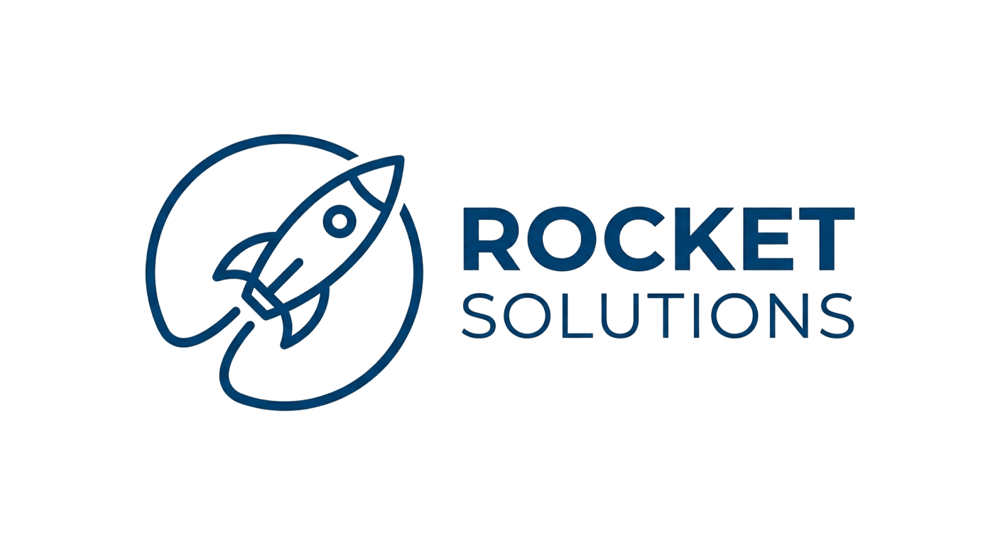
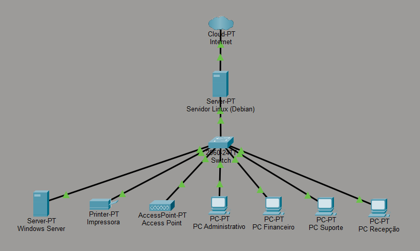

# Laboratório de Redes - Projeto Integrador Infraestrutura de TI

**Unidade Curricular 8 - SENAC**

> **Data:** 8 de junho à 3 de julho de 2026

**Integrantes:** Ryan Ferreira, Gabriel Alexandre, Felippe Camargo, Anderson Wilmer, Gustavo Massenio e Reginaldo Filho  
**Professores:** José de Assis e Leandro Ramos

---

## Objetivo Geral

Planejar, implantar, documentar e apresentar uma infraestrutura completa de TI para uma empresa fictícia de prestação de serviços, utilizando servidores Windows e Linux, rede corporativa, sistema de chamados e aplicação web.

---

## Sobre a Empresa

A Rocket Solutions é uma empresa voltada para a área de tecnologia da informação, com foco na implementação de soluções corporativas, suporte aos usuários e gerenciamento de infraestrutura de redes e servidores.

---

## Topologia Lógica da Rede

Imagem da topologia usada:

---

## Documentação

Para informações detalhadas, sobre a infraestrutura, configurações e desenvolvimento do projeto, consulte a [wiki do repositório](https://github.com/wilmeryf/infraestrutura-corporativa/wiki).
